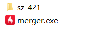
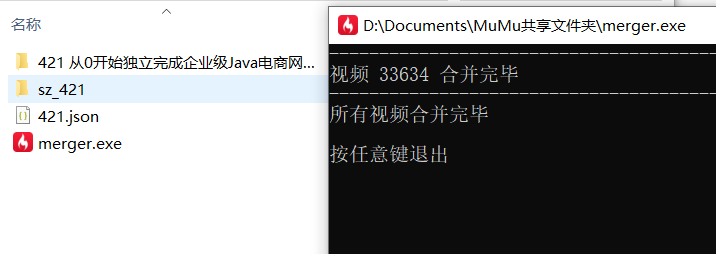

## 慕课网离线视频合并工具

工具下载：[merger](https://github.com/necan/iMoocMerger/releases)

使用步骤：

1. 在安卓机或 MuMu 模拟器上安装慕课网 app 并下载你购买的视频。

2. 视频位于 SD 卡下的 `Android/data/cn.com.open.mooc/video` 中，其中 `sz_` 开头的文件夹存放的就是实战（收费）视频，`mf_` 开头的文件夹存放的就是免费视频。

   

3. 视频文件夹中：除了视频文件 `*.ts`，`down.m3u8` 和 `key.hxk` 文件缺一不可，如果缺少，请检查是哪一个 `*.all` 文件夹中缺少，删除它，然后重新下载。

   

4. 将所有的 `sz_*` 和 `mf_*` 文件夹复制到电脑上，下载我提供的合并工具 `merger.exe`，将 `merger.exe` 放在 `sz_*` 或 `mf_*` 文件夹同一级目录下。

   

5. 双击 `merge.exe`，等待合并完成。

   

